# ML Zoomcamp 2023 Capstone 1 Project - Military Aircraft Detection

 
Image created Microsoft Bing Image Creator (https://www.bing.com/images/create)

## Problem Description
The used dataset is from [Kaggle](https://www.kaggle.com/datasets/a2015003713/militaryaircraftdetectiondataset/data). It is a military aircraft detection dataset. This is a very huge dataset with more than 33.3k image files of 46 different military aircrafts. For this project I chose images from the "crop" folder which was still too much (>20.5k images). At the end I only used images from the A400M, C130, Su57, and Tu160 folder for this project. The goal is to detect the correct type of aircraft on image data. 

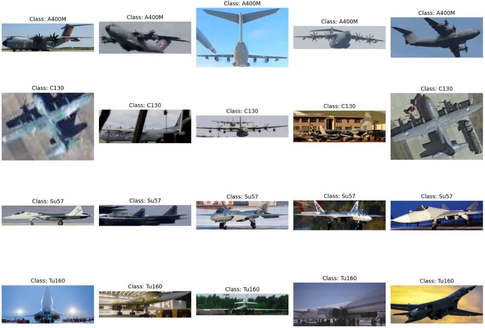

## First Steps
As mentioned under the previous section the dataset is very huge. Therefor I cannot provide it here in this repository. To get that data go to [Kaggle](https://www.kaggle.com/datasets/a2015003713/militaryaircraftdetectiondataset/data) and login. Then you can download the 12 GB package of aircraft images. Unzip that package and go to the "crop" folder. There are a lot of image folders. Copy the folders of "A400M", "C130", "Su57", and "Tu160" to the Data/train folder. 
Then you have the following folder structure:

 - Data/train/A400M
 - Data/train/C130
 - Data/train/Su57
 - Data/train/Tu160

 Now we need to exclude a few images for the test set. To do that just cut 10 images of each aircraft folder and put them to the same folder under Data/test. So that at the end you also have the same structure under test.

  - Data/test/A400M
  - Data/test/C130
  - Data/test/Su57
  - Data/test/Tu160

If you don't want to move images by your own, you can use a script for that. You only need to copy the 4 mentioned folders from the "crop" directory to the train folder and then use the script.

- **cd Utils**
- **python3 prepareTestFolder.py**

When everything is done, you should get a feedback in the terminal with all moved files in their new directory.

## Data
As you can see on the images above, they are neither standardized in format nor in size. I expect a challenging detection process. There is another challenge, because the dataset is very imbalanced. So this will also have an impact.

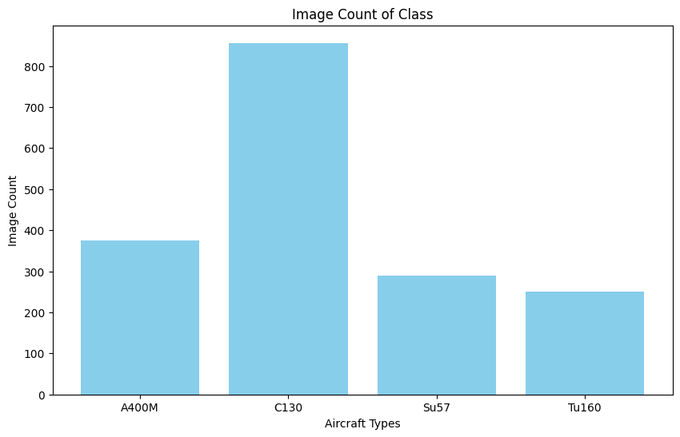

The test dataset consists of 10 images per class. (Images are rescaled here for better visual representation).

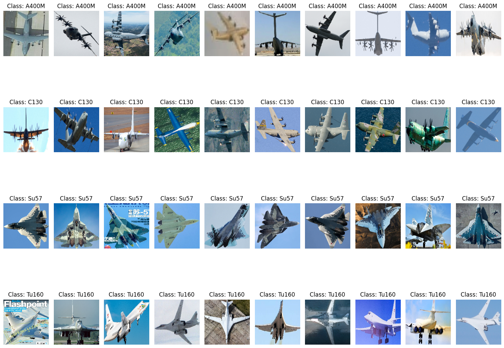

This project provides a model to predict this 4 aircraft types. 
There are two notebooks (/Notebook/notebook.ipynb and /Notebook/notebook_gpu.ipynb) that contain almost the same:
- Data preparation 
- Data analysis
- Training of multiple models
- Tuning of multiple models 
- Selecting the best model

Why there are two similar notebooks? I realized that image classification on CPU is a quite time consuming task. Therefor I decided to setup an Ubuntu PC with GPU support. To not loose all the old results I just copied the notebook and rerun all Jupyter cells. Because of the increased speed this notebook contains some more experiments to tune the model.

The model is provided as containerized web service that listens on port 9797.

## Script train.py

This script starts the final training. There is the final neural network architecture as a result from all the tuning that was done in the Jupyter notebook. The final architecture is shown on the image below.

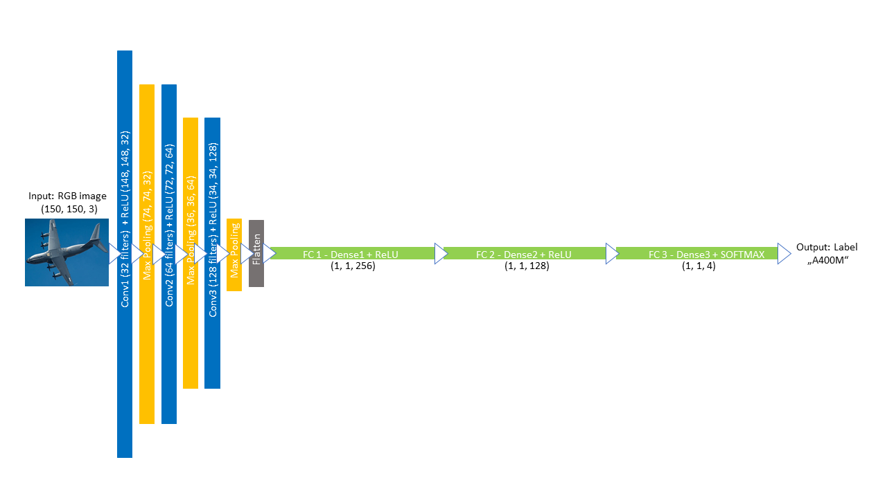

To start a new training just use the following commands:

- **pipenv shell**
- **cd Scripts**
- **python3 train.py**

## Script predict.py

After the training process, which I mentioned before, you can test the model with the predict.py script. This loads the model "final-model.tflite" and serves it via web service. You can train your own model and convert it to tflite format. You just need to adapt the model_file variable. You can start the Flask application with this commands:

- **pipenv shell**
- **cd Scripts**
- **python3 predict.py**

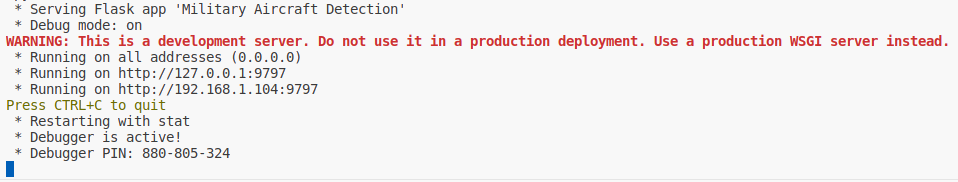

You can test the model by providing an url to an image file. There is already an example image in the "predict-test.py" script. Feel free to change it to another image. The Flask application will download the image an save it as "aircraft.jpg" and return the predicted label of that aircraft. Open a new terminal an use this command:

- **pipenv run python3 predict-test.py**

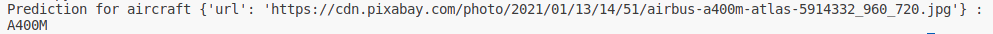

## Model serving with TensorFlow Serving

In this section I describe how I use TensorFlow Serving (TF Serving) to serve the model. Please note I use my GPU for this scenario, because TF Serving knows how to make use of it. Therefor I need to use a different TensorFlow Serving image tensorflow/serving:2.14.1-gpu. You can try to use tensorflow/serving:2.14.1, maybe it'll work as well. The following image show the architecture. There are two components the gateway which is a Flask application and the model which is served with TF Serving. Users can send an url of an aircraft image to the gateway. This part is implemented in the model_server_test.py script. The gateway do some preprocessing like resizing and sends the preprocessed image to the model and gets back the prediction. You can find the gateway implementation in the model_server.py file.

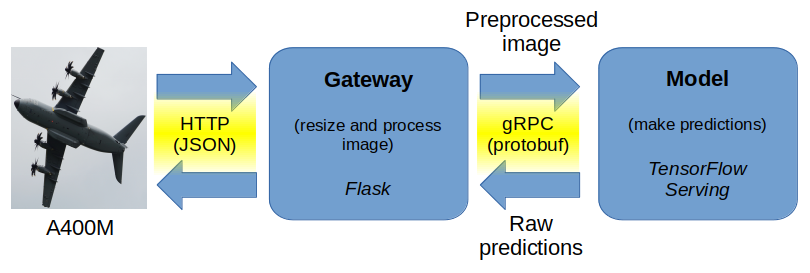

There is a Jupyter notebook in the Notebook folder of this project called "notebook_TFServing.ipynb" where I prepare model serving with TensorFlow Serving. I used the final model "final_0.725.h5" and convert it to the saved_model format. Then I was able to extract important information with the help of this command:

- !saved_model_cli show --dir './../Model/aircraft-model/' --all

The next screenshot show the information about "signature_def" which is the signature definition.

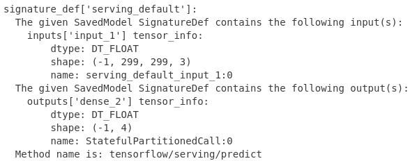

Before I could test anything I needed to start the TF Serving part. I used this docker command. In my case it didn't worked, so I need to exchange "$(pwd)" with the absolute path to the model. 

- **docker run -it --rm -p 8500:8500 -v "$(pwd)/aircraft-model:/models/aircraft-model/1" -e MODEL_NAME=aircraft-model tensorflow/serving:2.14.1-gpu**

As mentioned before if you cannot use your NVIDIA graphic adapter for this, maybe you can also try the following command that uses an image for CPU support.

- **docker run -it --rm -p 8500:8500 -v "$(pwd)/aircraft-model:/models/aircraft-model/1" -e MODEL_NAME=aircraft-model tensorflow/serving:2.14.1**

I also used this notebook to invoke the TF Serving model from Jupyter. Everything was working fine so I could convert this notebook to Python scripts (Script folder). "model_server.py" provides the Flask application and you can start that app with same commands as seen before: 

- **pipenv shell**
- **cd Scripts**
- **python3 model_server.py**

You can test the model by providing an url to an image file. There is another sample image in the "model_server_test.py" script. Again feel free to change it to another one. The Flask application will download the image an save it as "aircraft.jpg" and return the predicted label of that aircraft. Open a new terminal an use this command:

- **pipenv run python3 model_server_test.py**

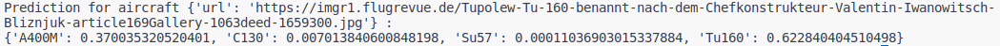

The model is not quite as sure about this image as before, but it was able to identify the correct aircraft type.

## Serverless Deployment with AWS Lambda

In this section I describe how I used AWS Lambda for the deployment of my model. The next image gives you an overview about how this works. There is AWS Lambda that takes care of the model, gets an url of an aircraft image, applies the model, and returns the prediction.

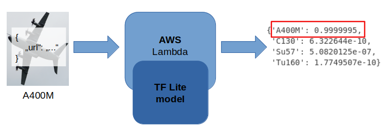

You can find all the preparation in the Jupyter notebook called "notebook_serverless.ipynb" in the Notebook folder. If you want to see this in action you need the following commands:

- **pipenv shell**
- **cd Deployment**
- **docker build -t aircraft-model .**
- **docker run -it --rm -p 8080:8080 aircraft-model:latest**

Now you have a docker container running with the image public.ecr.aws/lambda/python:3.9. That container is waiting to answer prediction requests for given urls of aircraft images. To send a request you can use the test.py script. Open another terminal window and use that commands to run the test:

- **pipenv shell**
- **cd Deployment**
- **python3 test.py**

You will see the result in the terminal output. For every url the output contains the probability for each type. In this example an Airbus A400M is shown and successfully detected.

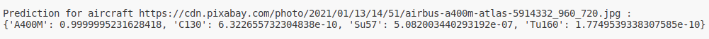

## Reproducibility
It's convenient to track my progress using the Makefile, which provides all the necessary commands:
1. To set up the environment, use "make environment" or follow the listed commands.
2. Inspect the Jupyter notebooks in the Notebook folder.
3. Start model training of the final model with "make train", saving it in the Model folder.
4. Deploy the web server in a Docker container listening on port 9797 with "make deploy".
5. Test the deployment with "make test_deploy" using a sample aircraft image.

Additional commands for managing the environment:
- "make stop_docker" to halt running Docker containers.
- "make clean" for environment cleanup
- "make deactivate_environment" to deactivate the environment in the current terminal (in case I forget about the "deactivate" command)